# High-precision-Fidelity-Estimation-with-Common-Randomized-measurements

[](https://arxiv.org/abs/2511.22509)
[](https://opensource.org/licenses/MIT)


## Abstract of the paper
Efficient fidelity estimation of multiqubit quantum states is crucial to quantum information processing. However, existing protocols require order $1/\epsilon^2$ different circuits to estimate the infidelity $\epsilon$ to multiplicative precision, posing a major bottleneck for high-precision fidelity estimation. Here, we prove that Clifford-based common randomized measurement (CRM) shadow estimation achieves a quadratic reduction to $1/\epsilon$ circuits. This follows from tight variance bounds for arbitrary observables under Clifford CRM, controlled by the deviation between the true state and a chosen prior. Under dominant noise models---including depolarizing and Pauli noise---the circuit cost collapses to a constant, independent of both $\epsilon$ and the qubit number, and a single circuit often suffices for intermediate and large systems. We further show that experimentally simpler Clifford measurements outperform $4$-design measurements in many practical scenarios, while both offer exponential advantages over Pauli measurements.


## Repository Introduction
The codes in this project are primarily designed to:
* Compute various quantum state fidelities, cross characteristic functions, and twisted cross characteristic functions and other relevant quantities discussed in the paper https://arxiv.org/pdf/2511.22509.
* Simulate the numerical values of these quantities under different noise models.
* Evaluate and compare the variance and circuit cost of different estimation protocols.

## Notice
These source codes are only responsible for generating the data in the paper, and therefore need further reasonable selections to obtain the figures in the paper.  However, the current version of the paper on arXiv needs further update. This repository is responsible for the updated version, not the previous one.

## Requirements

This project is written in Python. We recommend using `conda` or `pip` to create a virtual environment.

Core dependencies:
* Python >= 3.11.5
* Numpy
* Scipy
* Matplotlib
* Pandas
* Paddlepaddle    
* Paddle-quantum
* Mpi4py

## Citation
```bibtex
@misc{yang2025highprecisionfidelityestimationcommon,
      title={High-Precision Fidelity Estimation with Common Randomized Measurements}, 
      author={Zhongyi Yang and Datong Chen and Zihao Li and Huangjun Zhu},
      year={2025},
      eprint={2511.22509},
      archivePrefix={arXiv},
      primaryClass={quant-ph},
      url={https://arxiv.org/abs/2511.22509}, 
}
```

## Figure-Code Mapping

Here is a detailed guide on how to reproduce the core figures in our paper. 

### Fig. 2
<p align="center">
  
</p>

* **Corresponding Script**: `upperbound_k_0808.py`, `4design_upperbound_k.py`, `4design_and_Clifford_sametime(0304coherent).py`
---

### Fig. 3

<p align="center">
  
</p>

* **Corresponding Script**: `runmpi.py` (Only Pauli CRM is considered, since analytical expressions of 4-design and Clifford CRM can be easily obtained.)


---


### Fig. 4
<p align="center">
  
</p>

* **Corresponding Script**: `single_pauli_error.py` (For both Clifford and 4-desgin CRM, one needs to change the parameter 'fdesign=True' to decide the schemes.)
---


### Figs. S1 and S2
<p align="center">
  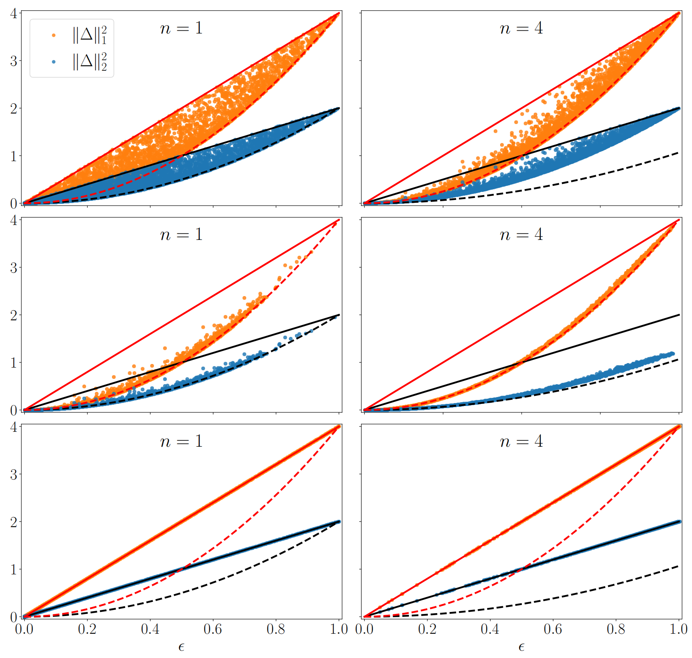
</p>
<p align="center">
  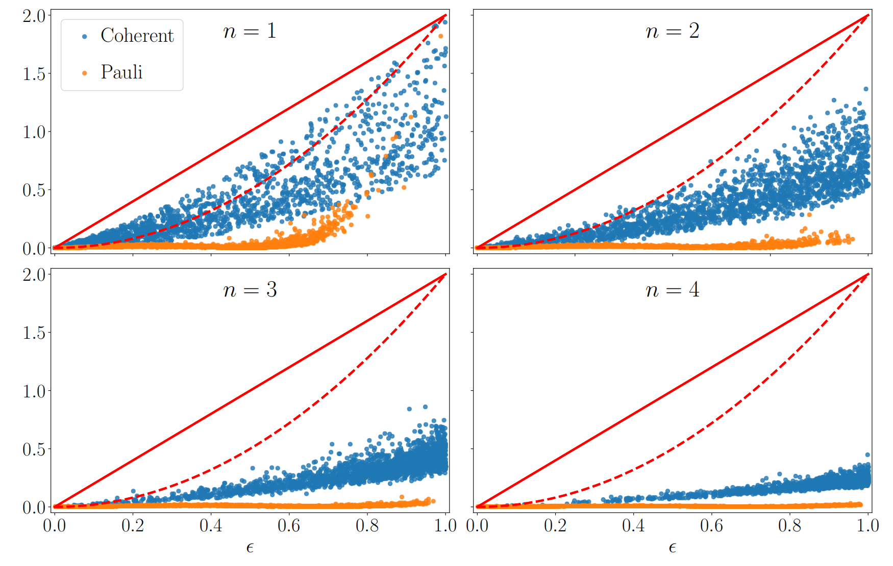
</p>

* **Corresponding Script**: `sampling0820.py` (For both Clifford and 4-desgin CRM, Pauli noise), and `sampling0820_unitary.py` (For both Clifford and 4-desgin CRM, coherent noise)
---


### Fig. S3
<p align="center">
  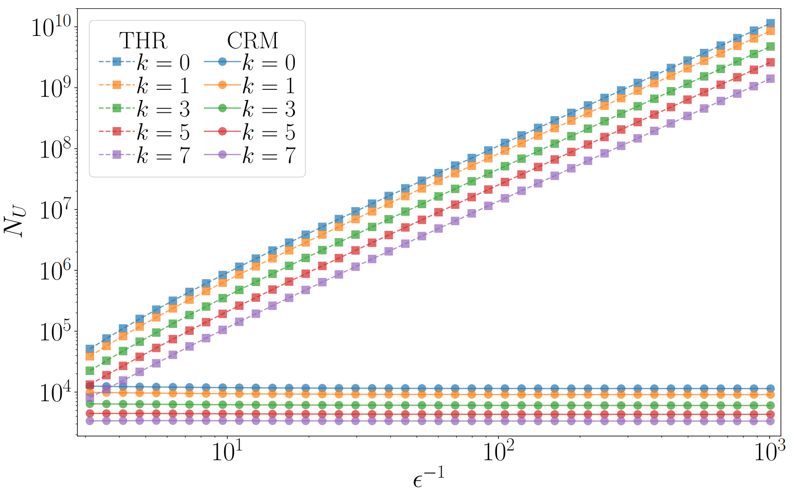
</p>

* **Corresponding Script**: `upperboundterms_k_depolar.py` 
---


### Fig. S4
<p align="center">
  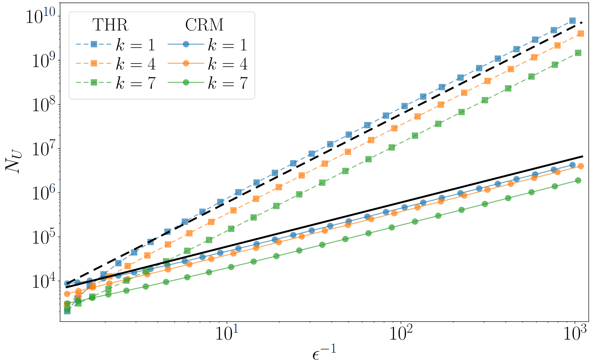
</p>

* **Corresponding Script**: `unoise_1022vio.py` 
---


### Fig. S5
<p align="center">
  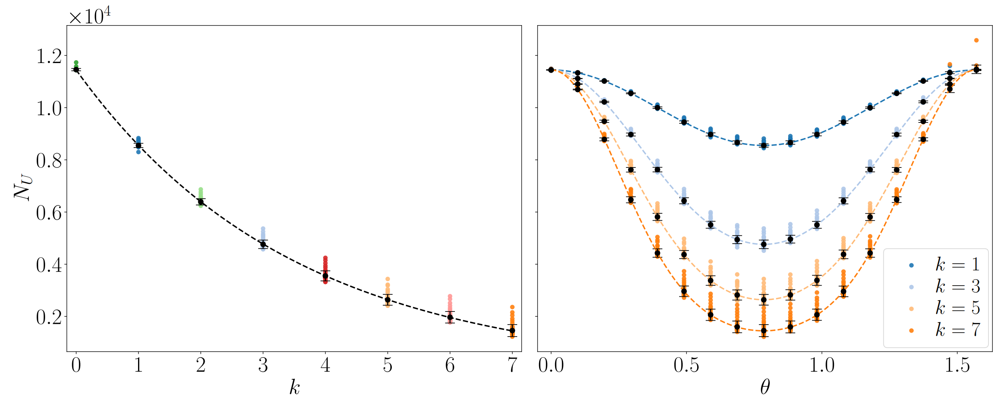
</p>

* **Corresponding Script**: `upperbound_k_0808.py` (User needs to specify the parameters correctly)
---


### Fig. S6
<p align="center">
  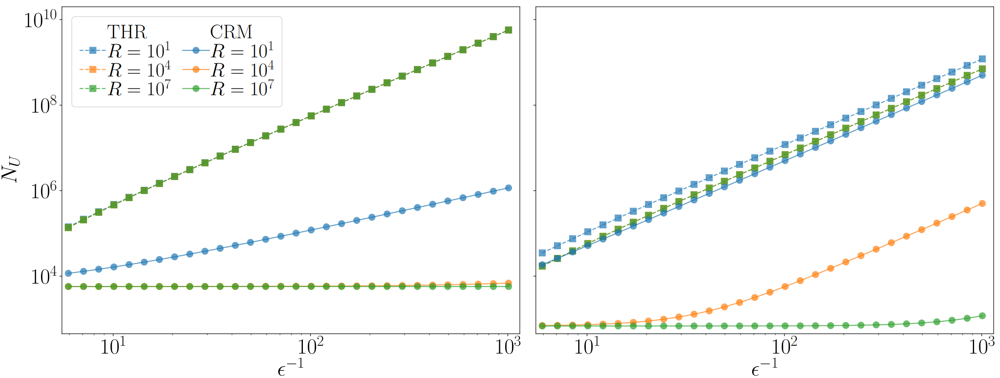
</p>

* **Corresponding Script**: `A_Small_repetition_upperbound_k.py` 
---


### Fig. S7
<p align="center">
  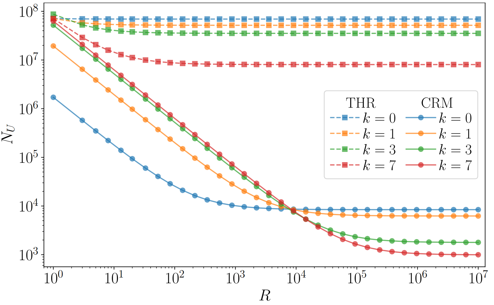
</p>

* **Corresponding Script**: `upperboundterms_k copy 2.py` 
---


### Fig. S8
<p align="center">
  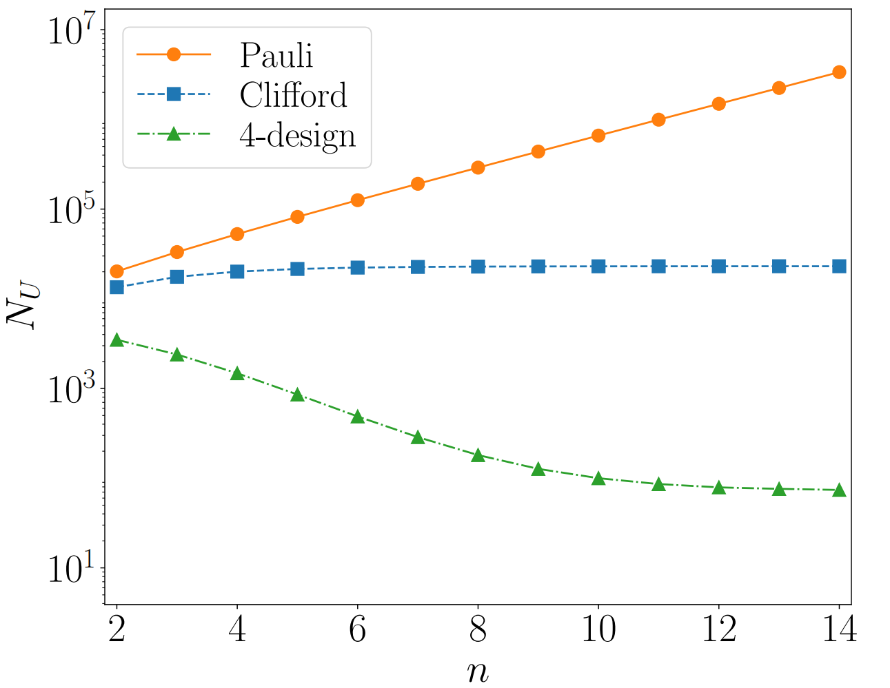
</p>

* **Corresponding Script**: `ghz_diffferent_n.py` 
---

### Fig. S9
<p align="center">
  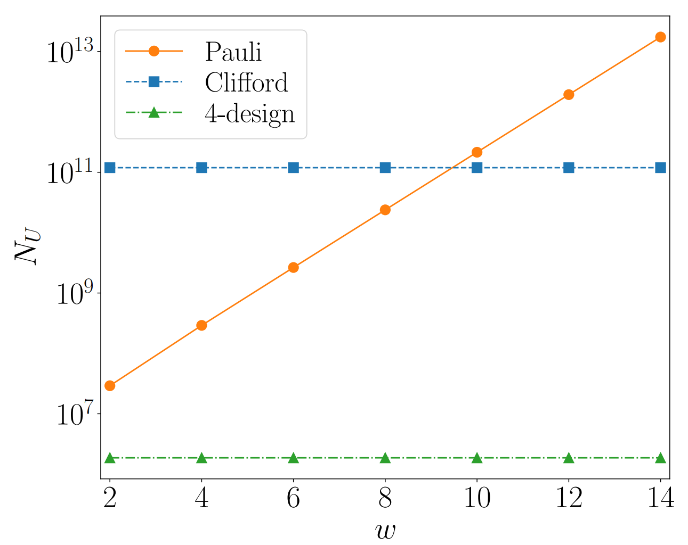
</p>

* **Corresponding Script**: Calculated directly by Eqs. (2), (165) and (166).
---


### Figs. S10 and S11
<p align="center">
  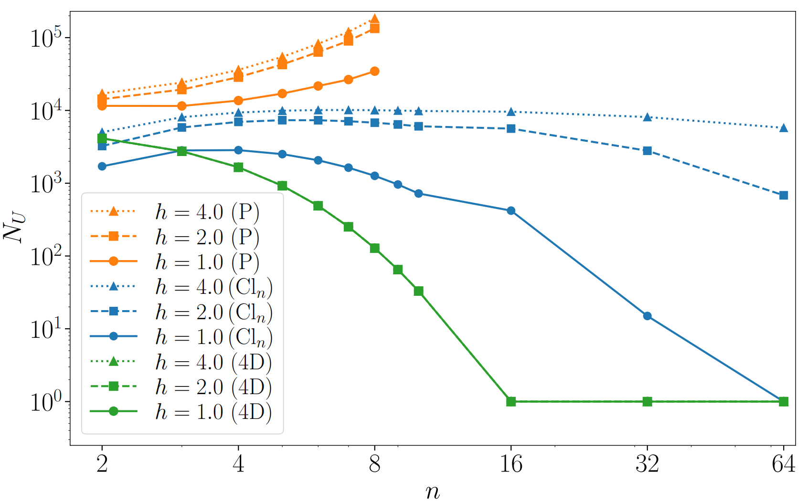
</p>

<p align="center">
  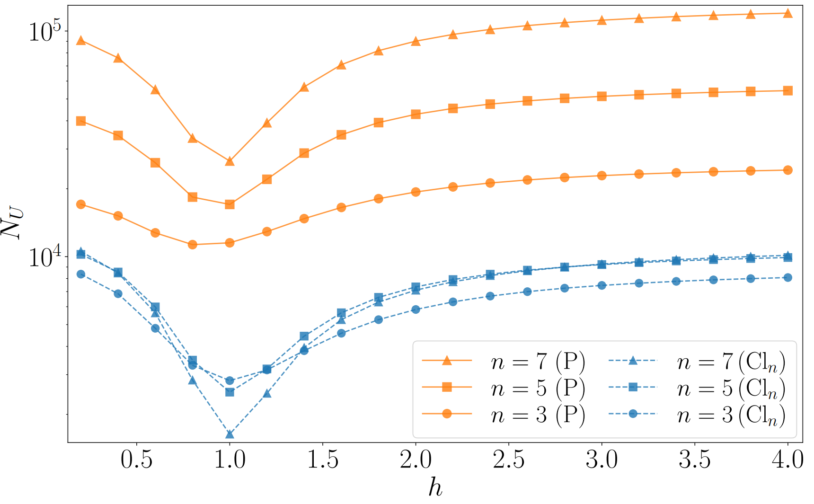
</p>

* **Corresponding Script**: The results of Clifford and 4-design CRM is calculated directly by corresponding equations in the paper, and the results of Pauli CRM is based on `PauliCRMTFIM_EDGS.py
`
---
