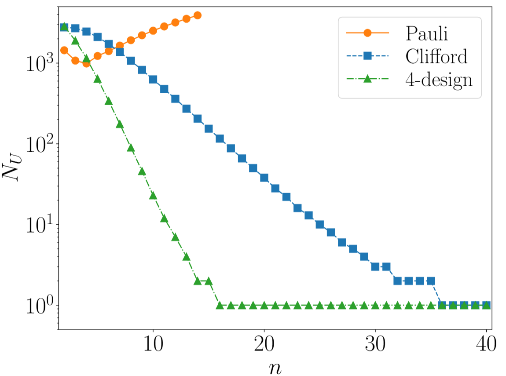
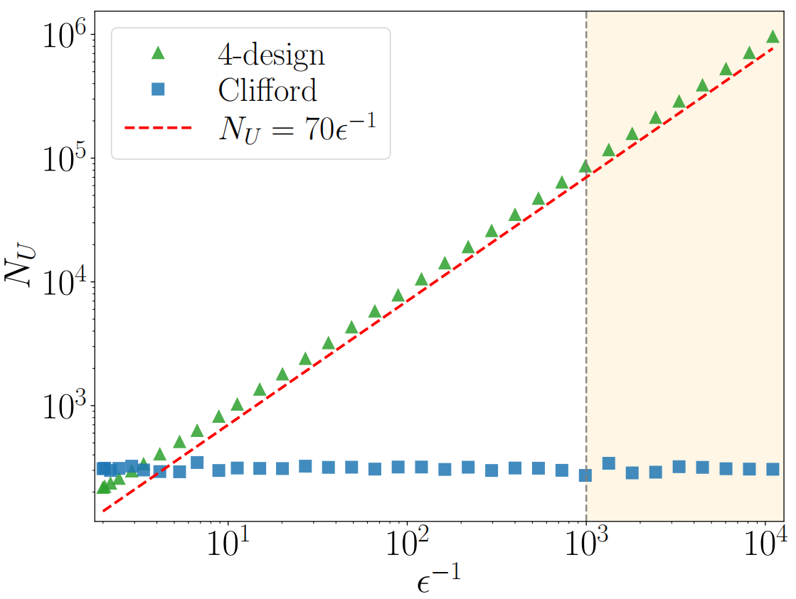

# High-precision-Fidelity-Estimation-with-Common-Randomized-measurements

[](https://arxiv.org/abs/2511.22509)
[](https://opensource.org/licenses/MIT)

The code is primarily designed to:
* Compute various quantum state fidelities, cross characteristic functions, and twisted cross characteristic functions and other relevant quantities discussed in the paper https://arxiv.org/pdf/2511.22509.
* Simulate the numerical values of these quantities under different noise models.
* Evaluate and compare the variance and circuit cost of different estimation protocols.

## Notice
These source codes are only responsible for generating the data in the paper, and therefore need further reasonable selections to obtain the figures in the paper. 

## Requirements

This project is written in Python. We recommend using `conda` or `pip` to create a virtual environment.

Core dependencies:
* Python >= 3.11.5
* Numpy
* Scipy
* Matplotlib
* Pandas
* Paddlepaddle    
* Paddle-quantum
* Mpi4py

## Citation
```bibtex
@misc{yourlastname2026fidelity,
      title={High-precision Fidelity Estimation with Common Randomized measurements}, 
      author={Firstname Lastname and Firstname Lastname and Firstname Lastname},
      year={2026},
      eprint={2603.xxxxx},
      archivePrefix={arXiv},
      primaryClass={quant-ph}
}
```

## Reproducing the Figures (Figure-Code Mapping)

Here is a detailed guide on how to reproduce the core figures in our paper. 

### Fig. 2
<p align="center">
  
</p>

* **Corresponding Script**: `upperbound_k_0808.py`, `4design_upperbound_k.py`, `4design_and_Clifford_sametime(0304coherent).py`
---

### Fig. 3

<p align="center">
  
</p>

* **Corresponding Script**: `runmpi.py` (Only Pauli CRM is considered, since analytical expressions of 4-design and Clifford CRM can be easily obtained.)


---


### Fig. 4
<p align="center">
  
</p>

* **Corresponding Script**: `single_pauli_error.py` (For both Clifford and 4-desgin CRM, one needs to change the parameter 'fdesign=True' to decide the schemes.)
---
